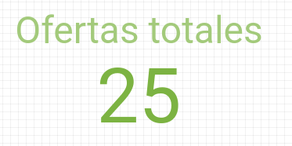
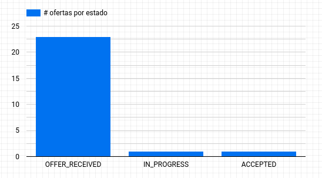
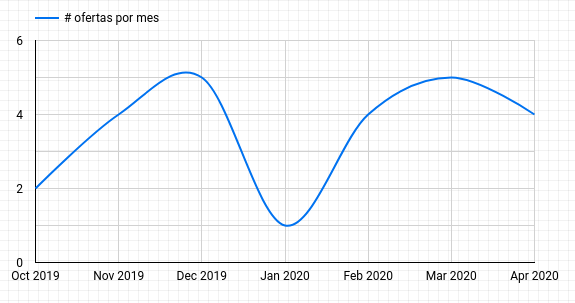
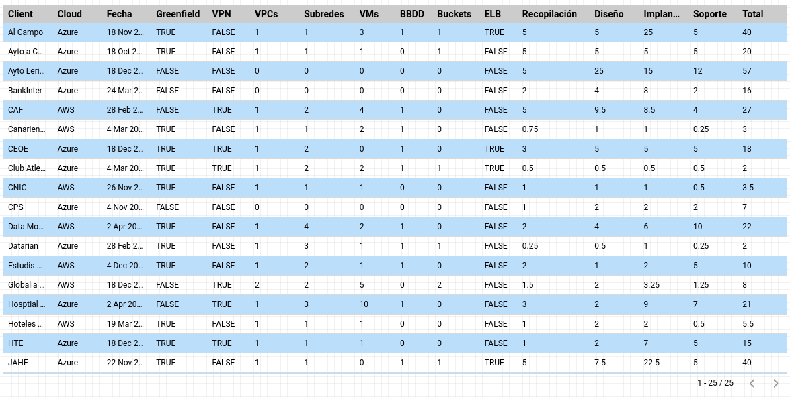
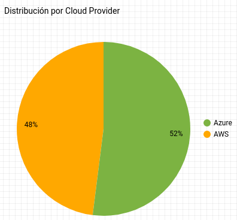
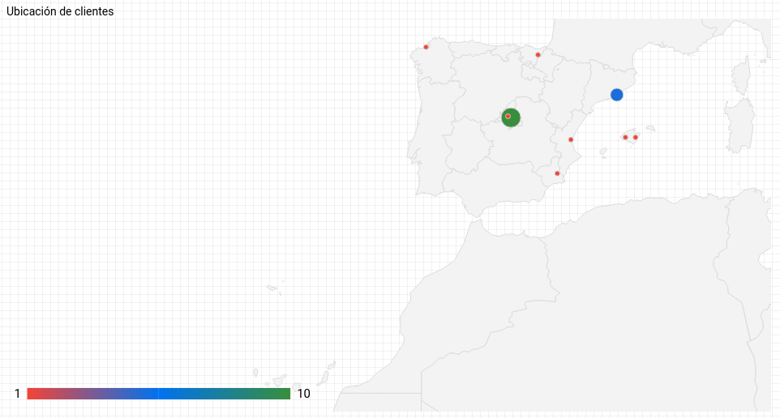

# Day Offers Dashboard


Day Offers Dashboard is an application that provides the following functionalities:

1. Extraction of data from instances of the *Day Pre-Estimation Calculator.xlsm*
2. Population of the extracted data to a CSV dataset file
3. Publishing of the extracted data to a Google Sheet instance which is the data source for a Google Data Studio Dashboard

# Prerequisites

The following prerequisites are required:

- Windows 10+
- Microsoft Excel 2016+
- Dot Net Framework 3.5+
- A valid Google Account (GMail account is sufficient)
- Python 3.7+ installation ([WinPython portable](https://winpython.github.io/) version is sufficient)

# Google Service Account

In order to use the Google Sheets and Google Drive API's, a Google Service Account is required.

The steps below described the high level process.

## Create the service account and enable the API's
1. Go to [GCP Console](https://console.developers.google.com/projectselector/apis/library?pli=1&supportedpurview=project)
2. Create a project
3. Enable Google Drive API
4. Enable Google Sheets API
5. Create a service account (no need to add a role or grant specific user access)
6. Create Key and download as JSON format

More info can be found at the following link; https://medium.com/@denisluiz/python-with-google-sheets-service-account-step-by-step-8f74c26ed28e

## Create and share a Google Sheet
1. Upload the [assets/data/skeleton-workbook.xlsx](skeleton-workbook.xlsx) to Google Sheets to create the data source
2. Share the workbook with the service account (`some-service-account@some-gcp-project.iam.gserviceaccount.com`)
3. To update this workbook you need to provide the Workbook Id that is part of the Google Sheet URL.

# Python configuration

```bash
set PATH=%PATH%;C:\path\to\python;C:\Users\<username>\AppData\Roaming\Python\Python38\Scripts
git clone https://github.com/damianmcdonald/day-offers-dashboard.git day-offers-dashboard
set PYTHONPATH=D:/path/to/day-offers-dashboard/src
cd day-offers-dashboard
pip install --user --upgrade pip
pip install --user -r requirements.txt
```

# Compatibility

`day-offers-dashboard` is compatible with a `csv` dataset that conforms to the following schema/structure:

| Field name  | Position  | Type | Example | Description |
| -------- | -------- | -------- | -------- | -------- |
| client | 1 | String | Mapfre | Name of the client |
| status | 2 | String | OFFER_RECEIVED | Enum of offer status; OFFER_RECEIVED, COMPLETE, IN_PROGRESS, ACCEPTED | 
| statusDate | 3 | String | 2020-04-27 | Date of offer using [JavaScript ISO 8601](https://www.w3schools.com/js/js_date_formats.asp) date format. | 
| cloud | 4 | String | AWS | Enum of cloud providers; AWS, Azure, GCP |
| greenfield | 5 | Boolean | TRUE | Indicates if the offer is for a Greenfield installation |
| regions | 6 | Number | 1 | Number of cloud regions considered in the offer |
| accounts | 7 | Number | 1 | Number of cloud accounts considered in the offer |
| applications | 8 | Number | 1 | Number of applications to be migrated in the offer |
| vpcs | 9 | Number | 1 | Number of vpcs considered in the offer |
| subnets | 10 | Number | 1 | Number of subnets considered in the offer |
| hasConnectivity | 11 | Boolean | TRUE | Indicates if the offer requires On-Premises connectivity |
| hasPeerings | 12 | Boolean | TRUE | Indicates if the offer requires VPC Peerings |
| hasDirectoryService | 13 | Boolean | TRUE | Indicates if the offer requires a directory service (Active Directory or LDAP) |
| hasAdvancedSecurity | 14 | Boolean | TRUE | Indicates if the offer requires advanced security group and NACL configuration |
| hasAdvancedLogging | 15 | Boolean | TRUE | Indicates if the offer requires advanced logging configuration |
| hasAdvancedMonitoring | 16 | Boolean | TRUE | Indicates if the offer requires advanced monitoring configuration |
| hasAdvancedBackup | 17 | Boolean | TRUE | Indicates if the offer requires advanced backup configuration |
| virtualMachines | 18 | Number | 1 | Number of virtual machines to be included in the offer |
| buckets | 19 | Number | 1 | Number of object storage instances to be included in the offer |
| databases | 20 | Number | 1 | Number of PaaS databases to be included in the offer |
| hasELB | 21 | Boolean | TRUE | Indicates if the offer requires a Load Balancer |
| hasAutoScripts | 22 | Boolean | TRUE | Indicates if the offer requires automation scripts (CloudFormation, ARM, Terraform) |
| hasOtherServices | 23 | Boolean | TRUE | Indicates if the offer requires additional services that can not be auto-estimated by the Day Calculator |
| service1 | 24 | String | Elastic Beanstalk | Name of the additional service |
| service2 | 25 | String | Route 53 | Name of the additional service |
| service3 | 26 | String | Bastion | Name of the additional service |
| service4 | 27 | String | Active Directory | Name of the additional service |
| service5 | 28 | String | App Service | Name of the additional service |
| phase1EstimatePre | 29 | Number | 0.5 | Estimate generated by the Day Calculator for the recompilación phase |
| phase1Estimate | 30 | Number | 1 | Estimate generated by Architects for the recompilación phase |
| phase1Deviation | 31 | Number | 1 | The degree of deviation between the Day Calculator estimate and the Architects estimate for the recompilación phase |
| phase2EstimatePre | 32 | Number | 0.5 | Estimate generated by the Day Calculator for the diseño phase |
| phase2Estimate | 33 | Number | 1 | Estimate generated by Architects for the diseño phase |
| phase2Deviation | 34 | Number | 1 | The degree of deviation between the Day Calculator estimate and the Architects estimate for the diseño phase |
| phase3EstimatePre | 35 | Number | 0.5 | Estimate generated by the Day Calculator for the implantación phase |
| phase3Estimate | 36 | Number | 1 | Estimate generated by Architects for the implantación phase |
| phase3Deviation | 36 | Number | 1 | The degree of deviation between the Day Calculator estimate and the Architects estimate for the implantación phase |
| phase4EstimatePre | 37 | Number | 0.5 | Estimate generated by the Day Calculator for the soporte phase |
| phase4Estimate | 38 | Number | 1 | Estimate generated by Architects for the soporte phase |
| phase4Deviation | 39 | Number | 1 | The degree of deviation between the Day Calculator estimate and the Architects estimate for the soporte phase |
| totalPre | 40 | Number | 0.5 | Total estimate generated by the Day Calculator |
| total| 41 | Number | 1 | Total estimate generated by Architects |
| totalDeviation | 42 | Number | 1 | The degree of deviation between the Day Calculator estimate and the Architects estimate for the total offer |
| travel | 43 | Number | 0 | Number of travel days to the client premises included in the offer |
| administered | 44 | Boolean | TRUE | Indicates if the offer will be administered |
| geoLocation | 45 | String | Madrid | Name of the city where the client is situated |
| isValid | 46 | Boolean | TRUE | Indicates if the criteria of the offer fits within the constraints of the Day Calculator |

# Running the app

Start by modifying the environment specific parameters of the [run.bat](run.bat)

```dos
rem # adjust the values below for your environment
set PROJECT_DIR=D:/Devel/automation/source/dashboard-flow
set PYTHON_BIN=D:/Devel/tools/WPy64-3820/python-3.8.2.amd64
set PYTHONPATH=%PROJECT_DIR%/src
set PATH=%PATH%;%PYTHON_BIN%
set DATA_DIR=D:/Devel/automation/apps/dashboard-flow
```

The path defined in `DATA_DIR` should contain 2 sub-folders:

1. `dataset` - this folder should contain a `csv` dataset file
2. `calculators` - calculator instances should be placed in this folder

Execute [run.bat](run.bat) to activate the application menu.

The menu provides 5 options:

1. Create manifest.json
2. Build dataset
3. Publish dataset to Google Data Studio
4. Create manifest.json, build and publish dataset to Google Data Studio
5. Exit

# Google Data Studio

## Create the data source
1. Upload the [assets/data/skeleton-workbook.xlsx](skeleton-workbook.xlsx) to Google Sheets to create the data source
2. Share the workbook with the service account (`some-service-account@some-gcp-project.iam.gserviceaccount.com`)

## Create the dashboard instance
1. Create a new Dashboard
2. Select Google Sheets as the datasource
3. Authorize the dashboard to access Google Sheets if requested
4. Add the `dataset` worksheet
5. Add the `averages` worksheet
6. Add the `services` worksheet

## Configure the dataset worksheet

### Open the managed data source
1. Go to *Resource* menu
2. Choose *Manage added data sources*
3. Choose to *Edit* the `dataset` worksheet

### Change the `geoLocation` from Text to a *Geo* -> *Town/City*
1. Find the field `geoLocation`
2. Click the *Text* type in order to change the type
3. Select *Geo* -> *Town/City*
4. Click *Continue*

### Add the truncated status date in order to show visualizations per month
1. Click the three dots next to field `statusDate`
2. Choose duplicate
3. Find the `Copy of statusDate` and rename if to `status_date_yyyy_mm`
4. Choose the *Type* and change it to `Date and time` -> `Year Month (YYYYMM)`
5. Click `Finished`
6. Click `Close`

### Add a country calculated field with formula
```sql
CASE 
    WHEN geoLocation != "" THEN "Spain"
    ELSE "Spain"
END
```

### Concatonate the geoLocation and country fields
```sql
CONCAT(geoLocation, CONCAT(',', country))
```

## Add some visualizations

### Quarterly offers (Scorecard)



1. Click `Insert` -> `Scorecard`
2. Draw the `Scorecard` on the canvas
3. In *Date Range Dimension* add `statusDate`
4. In *Metric* add `Record Count` with `Auto` aggregation
5. In *Default date range* select `Custom`
6. In *Auto date range* select `This quarter to date`

### Offer states (Bar chart)



1. Click `Insert` -> `Bar chart`
2. Draw the `Bar chart` on the canvas
3. In *Metric* add `status`
4. In *Zoom area* choose `Spain`

### Offers per month (Time series)



1. Click `Insert` -> `Time series`
2. Draw the `Time series` on the canvas
3. Change the data source to the `averages` worksheet
4. In *Date Range Dimension* add `status_date_yyyy_mm`
5. In *Dimension* add `status_date_yyyy_mm`
6. In *Metric* add `client` with `Count Distinct` aggregation

### Tabular data (Table)



1. Click `Insert` -> `Table`
2. Draw the `Table` in the canvas
3. In *Date Range Dimension* add `statusDate`
4. In *Dimension* add `hasAdvancedMonitoring`
5. In *Metric* add `Record Count`

### Distribution by Cloud Provider (Pie chart)



1. Click `Insert` -> `Pie chart`
2. Draw the `Pie chart` on the canvas
3. In *Date Range Dimension* add `statusDate`
4. In *Dimension* add `cloud`
5. In *Metric* add `Record Count`
6. In *Sort* add `Record Count`

### Client locations (Geo map)



1. Click `Insert` -> `Geo map`
2. Draw the `Geo map` on the canvas
3. In *Geo dimension* add `geoLocation`
4. In *Zoom area* choose `Spain`
